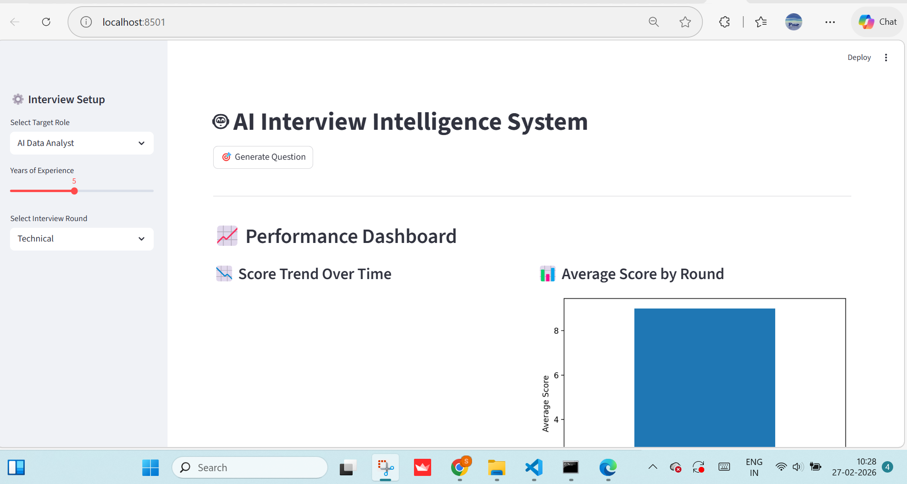
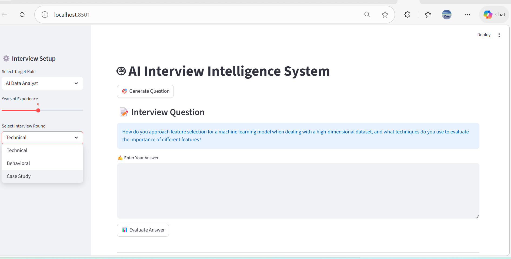
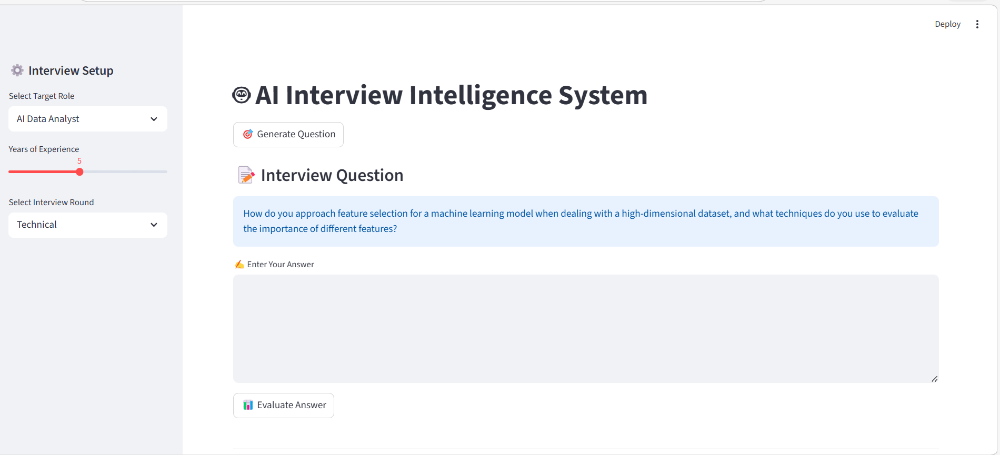
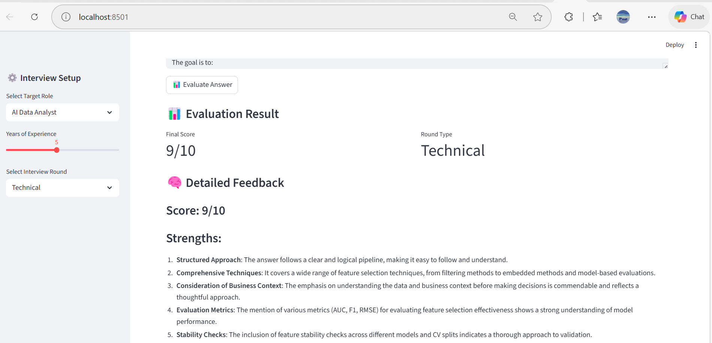
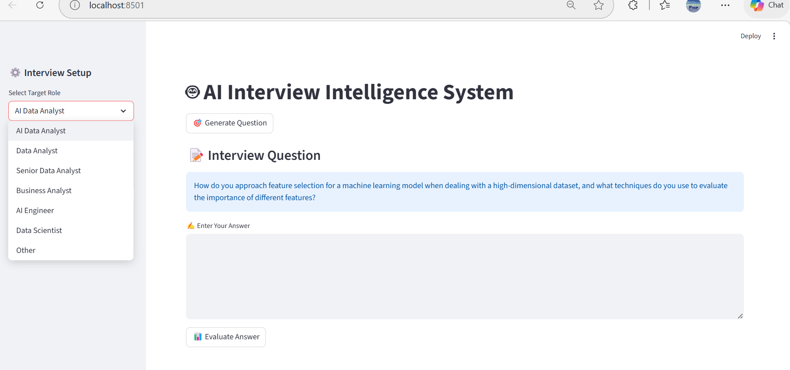
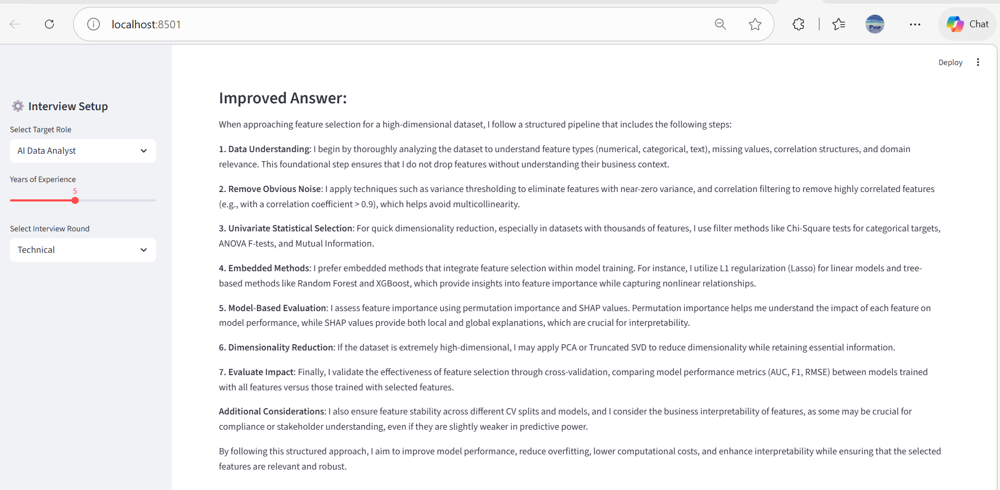
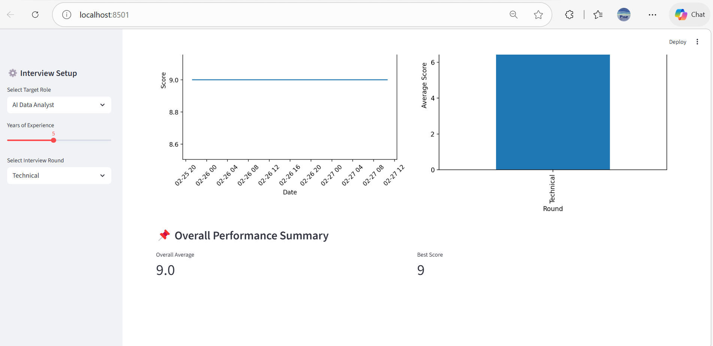
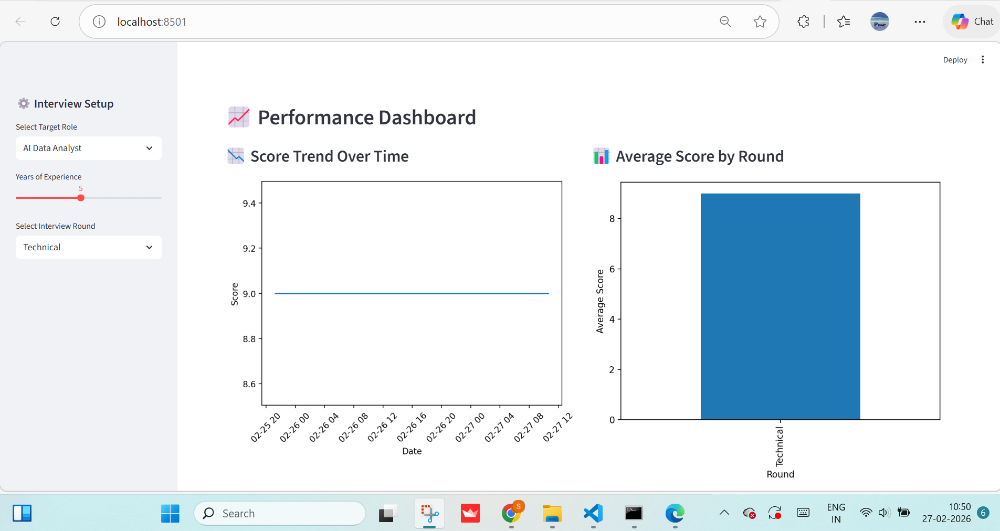
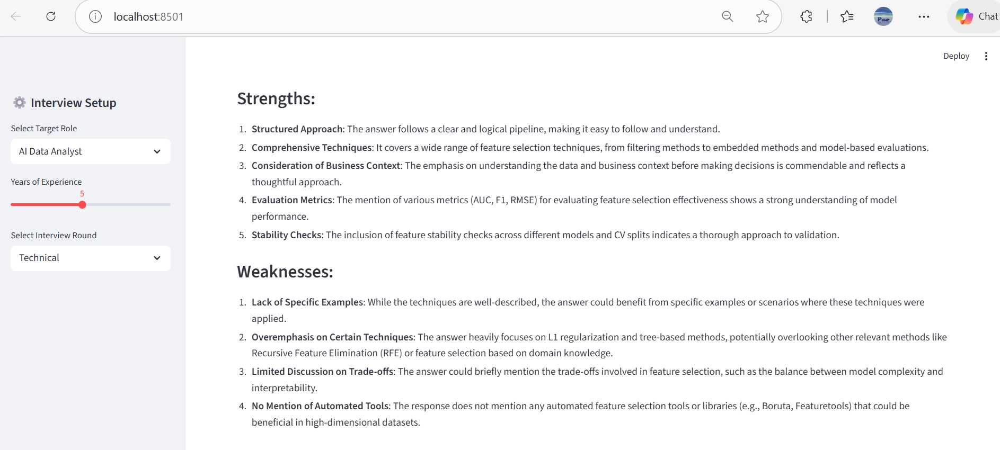

## AI_Interview_Intelligence_System

## Overview
The AI Interview Intelligence System is an enterprise-style AI application designed to simulate an intelligent technical interview platform.

The system evaluates candidate responses using NLP models, integrates business logic for response validation, and provides structured analytics to assist in assessment and decision-making.

This project demonstrates end-to-end AI system design including:
- Modular architecture

- NLP model integration

- Environment configuration management

- Reusable utilities

- Scalable project structure

## Business Objective
Recruitment processes require scalable and unbiased technical evaluation systems.

This solution enables:

- AI-driven question handling

- Intelligent response analysis

- Sentiment or evaluation scoring

- Structured modular deployment

- Expandable architecture for enterprise usage

## Project Architecture


```bash
AI_Interview_Intelligence_System/
│
├── app.py                         # Main Streamlit application (Entry point)
├── requirements.txt               # Project dependencies
├── .env                           # Environment variables (API keys, configs)
├── README.md                      # Project documentation
│
├── data/                          # Data storage layer
│   └── interview_history/         # Historical interview interactions
│
├── id_models/                     # Model management layer
│   └── list_models/               # Stored AI/ML model artifacts
│
├── modules/                       # Core business logic layer
│   ├── __init__.py
│   ├── answer_evaluator.py        # Evaluates candidate responses
│   ├── question_generator.py      # Generates interview questions
│   ├── scoring_engine.py          # Calculates evaluation scores
│   └── __pycache__/               # Compiled Python files
│
└── utils/                         # Utility & support layer
    ├── prompt_engine.py           # Prompt engineering logic (GenAI handling)
    ├── tracker.py                 # Tracks session/interview metrics
    └── __pycache__/               # Compiled Python files

## Layered Architecture Explanation

    ### 1️ Application Layer

    **app.py**

- Handles UI rendering via Streamlit  
- Manages interaction flow between user and backend modules  
- Acts as the system entry point  

---
### 2️⃣ Business Logic Layer (`modules/`)
- Question generation  
- Answer evaluation  
- Structured scoring logic  

---

### 3️⃣ Model Layer (`id_models/`)

- Stores AI/ML model artifacts  
- Supports model versioning and upgrades  

---

### 4️⃣ Data Layer (`data/`)

- Stores interview history  
- Can be extended to database storage  

---

### 5️⃣ Utility Layer (`utils/`)

- Centralized prompt engineering  
- Session tracking & metrics handling  

### Key Features

1. Modular Design

Clear separation between:

- Application layer

- Business logic layer

- Model layer

- Utility layer

This improves maintainability and scalability.

🔹 2. AI Model Integration

- Transformer-based NLP handling

- Pre-trained or fine-tuned models

Modular model loading from id_models/

🔹 3. Environment Management

- Sensitive variables managed via .env

- Clean separation of configuration from logic

🔹 4. Production-Ready Structure

- No hardcoded credentials

- Centralized configuration

- Clean Git structure

- Extensible architecture

## 🛠️ Tech Stack

| Category            | Tools                          |
|---------------------|--------------------------------|
| 🐍 Language         | Python                         |
| 🤖 NLP              | Hugging Face Transformers      |
| 🎨 UI               | Streamlit                      |
| 📊 Data             | Pandas                         |
| 📈 Visualization    | Matplotlib                     |
| ⚙️ Config Management| python-dotenv                  |
| 🗂️ Version Control  | Git                            |


## Installation

git clone https://github.com/yourusername/AI_Interview_Intelligence_System.git
cd AI_Interview_Intelligence_System
pip install -r requirements.txt


### Run Application

streamlit run app.py

## Environment Variables

Create a .env file:

OPENAI_API_KEY=your_api_key_here
MODEL_PATH=id_models/
DATA_PATH=data/interview_history/

## Why This Matters:

- Keeps sensitive credentials secure

- Enables environment-specific configuration

- Supports production deployment

## 📈 Scalability Roadmap

- Add interview performance scoring engine

- Integrate database (PostgreSQL / MongoDB)

- Add authentication layer

- Containerize using Docker

- Deploy to AWS / Azure

- Integrate analytics dashboard

## 🚀 Engineering Highlights

- Modular layered architecture (Application, Business, Model, Data, Utility layers)
- Environment variable–based secure API key management
- Centralized prompt engineering for consistency and scalability
- Version-controlled model artifacts for upgrade flexibility
- Extensible data layer for future database integration
- Structured scoring logic for explainable AI feedback
- Clean separation of concerns for maintainability

## 📸 Application Screenshots

### 🖥 Main Interface


### 🎯 Select Interview Round


### ❓ Question Display


### 📝 Answer Section


### 📊 Score Output


### 🔄 Change Role Feature


### ✨ Improved Answer Suggestion


### 📈 Overall Performance Summary


### 📊 Performance Dashboard


### 💪 Strength & Weakness Analysis


